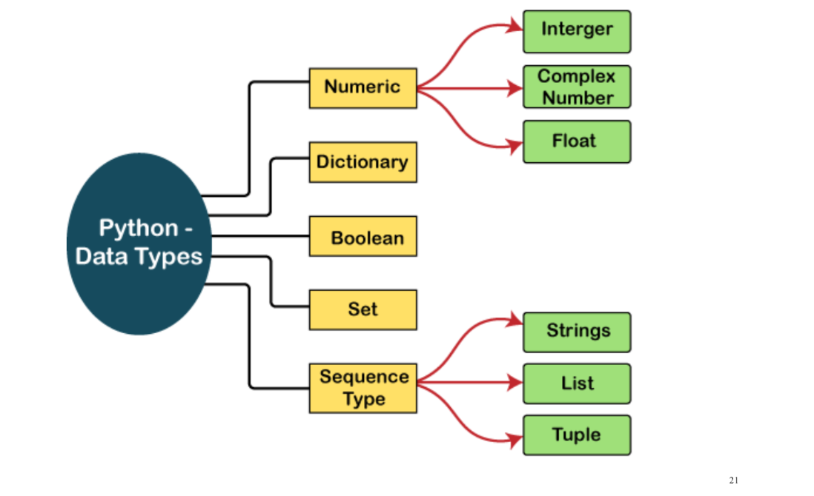

# Veri Tipleri
Python, farklı değer türlerini temsil etmek için kullanılan çeşitli yerleşik veri türlerine sahiptir. Python'da en sık kullanılan veri türlerinden bazıları aşağıda gösterilmiştir:

 

# 1. Sayısal Türler (Numeric Types)
Matematiksel işlemler için kullanılırlar.

int (Integer): Tam sayılar. (Örn: 10, -5, 0)
# örnek:
                     yas = 25
                     sicaklik = -10
                     sayfa_sayisi = 450

                     print(type(yas)) # <class 'int'>

float (Floating Point): Ondalıklı sayılar. (Örn: 15.5, 3.14, -0.5)
# örnek                             
        pi = 3.14
        boy = 1.85
        borc = -1500.75
        bilimsel_sayi = 2e3  # 2 * 10^3 yani 2000.0

        print(type(pi)) # <class 'float'>

complex: Karmaşık sayılar. (Örn: 3 + 5j)
# örnek 
              sayi = 3 + 5j

       print(sayi.real) # 3.0 (Gerçek kısım)
       print(sayi.imag) # 5.0 (Sanal kısım)
       print(type(sayi)) # <class 'complex'>

# 2. Metin Türü (Text Type)
str (String): Karakter dizileri. Tek veya çift tırnak içinde yazılırlar.

Örnek:  "Merhaba Dünya", 'Python 3'

# 3. Mantıksal Tür (Boolean Type)
bool: Sadece iki değer alabilir: True (Doğru) veya False (Yanlış). Karar mekanizmalarında (if-else) kullanılır.

# Sayısal Türler Arası Dönüşüm (Type Casting)
Python, bu türler arasında geçiş yapmanıza olanak tanır:

# örnek
          # Float'tan Int'e (Ondalık kısım atılır, yuvarlama yapılmaz)
          oran = 9.99
          tam_oran = int(oran) # 9

          # Int'ten Float'a
          puan = 50
          ondalikli_puan = float(puan) # 50.0

          # String'den Sayıya (Kullanıcıdan veri alırken çok kullanılır)
          gelen_veri = "100"
          sayi_verisi = int(gelen_veri) # 100
