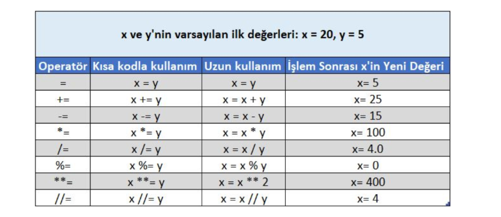
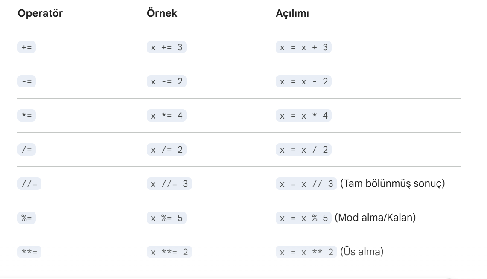
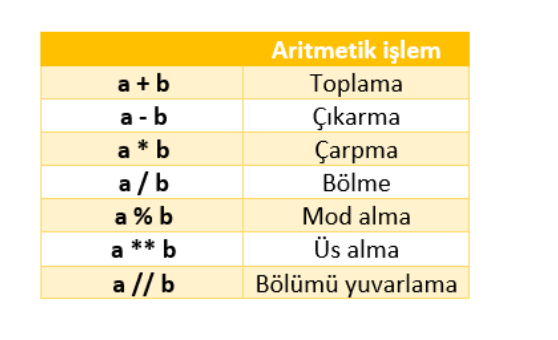

- [Giriş](#giriş)
- [Python Nedir](#Python-Nedir)
- [Python İndirme ve Kurma](#Python-İndirme-ve-Kurma)
- [Hangi IDE Seçmelisiniz](#Hangi-IDE-Seçmelisiniz)
- [PYTHON KULLANIM ALANLARI](#PYTHON-KULLANIM-ALANLARI)
- [PYTHON TEMEL OPERATORLER](#PYTHON-TEMEL-OPERATORLER)

  -[1. Atama Operatörleri](#1-Atama-Operatörleri)

# Giriş
"Kod espri gibidir. Açıklamak zorundaysanız kötüdür." (Python'ın okunabilirlik felsefesine atıfla) — Cory House

# Python Nedir?

Python, oldukça popüler ve öğrenmesi kolay bir programlama dilidir. Hem yeni başlayanlar hem de deneyimli geliştiriciler tarafından tercih edilmektedir. Python, çok yönlüdür, yani farklı amaçlar için kullanılabilir: web geliştirme, veri analizi, yapay zeka ve daha fazlası.
Python'ın temel avantajları:
Kolay Söz Dizimi: Yeni başlayanlar için çok uygundur.
Taşınabilirlik: Python, farklı işletim sistemlerinde (Windows, macOS, Linux) çalışabilir.
Zengin Kütüphaneler: Çeşitli kütüphaneleri sayesinde hemen hemen her alanda kullanılabilir.

# Python İndirme ve Kurma
Python'ı bilgisayarınıza kurmak için aşağıdaki adımları takip edebilirsiniz:
# Adım 1: Python'ın İndirilmesi
Python'ın Resmi Web Sitesine Git: Python'ın resmi web sitesi adresine gidin.
İndirme Sayfasını Ziyaret Et: Anasayfada, genellikle en üstte "Download Python" butonunu göreceksiniz. En son sürüm önerilir.
İndirilen Dosyayı Çalıştırın: Python, Windows, macOS ve Linux için farklı sürümler sunar. İhtiyacınıza uygun sürümü seçin ve indirme işlemi tamamlandıktan sonra dosyayı çalıştırın.
# Adım 2: Python'ın Kurulumu
Kurulum Sihirbazı Başlatın: İndirdiğiniz dosyayı çalıştırarak kurulum sihirbazını başlatın.
PATH'e Ekleme: Kurulum sırasında, "Add Python to PATH" seçeneğini işaretlemeyi unutmayın. Bu seçenek, Python'ı komut satırından çalıştırabilmeniz için önemlidir.
Kurulumu Tamamlayın: Kurulum tamamlandığında "Install Now" seçeneğine tıklayın. Python bilgisayarınıza yüklenecektir

# Python geliştirme ortamı 
Python geliştirme ortamı (IDE), Python programlarını yazmak, test etmek ve hata ayıklamak için kullanılan yazılımlardır. Python geliştirme ortamları, kod yazmayı çok daha verimli ve kolay hale getirir. En popüler Python IDE'lerinden bazıları PyCharm, Visual Studio Code (VSCode) ve Jupyter Notebook'tır. Şimdi, bu IDE'lerin nasıl yükleneceğini ve kullanılacağını adım adım açıklayalım.

# 1. PyCharm IDE'nin Kurulumu ve Kullanımı
PyCharm, Python geliştirmek için en popüler IDE'lerden biridir. Profesyonel özelliklere sahip olup, hata ayıklama ve test etme gibi araçlarla programlama sürecini kolaylaştırır.
# Adım 1: PyCharm İndirilmesi
PyCharm'ı JetBrains'in Resmi Web Sitesinden indirebilirsiniz.
İki sürüm vardır:
Community (Ücretsiz): Temel özellikler içerir, genellikle yeni başlayanlar için yeterlidir.
Professional (Ücretli): Daha fazla özellik içerir, özellikle web geliştirme gibi alanlarda kullanışlıdır.
İhtiyacınıza uygun sürümü seçin ve indirme işlemini başlatın.

# 2. Visual Studio Code (VSCode) IDE'sinin Kurulumu ve Kullanımı
Visual Studio Code (VSCode), hafif bir editör olup, Python geliştirme için çok yaygın kullanılır. Ücretsizdir ve eklentilerle zenginleştirilebilir.
# Adım 1: VSCode İndirilmesi
Visual Studio Code'u VSCode Resmi Web Sitesinden indirebilirsiniz.
İndirme işlemi tamamlandığında, dosyayı çalıştırarak kurulumu başlatın.
# Adım 2: Python Eklentisi Yüklemek
VSCode kurulduktan sonra, Python desteği için Python eklentisini yüklemelisiniz. Bunun için:
VSCode'u açın.
Sol tarafta bulunan Extensions (Eklentiler) sekmesine tıklayın.
Arama kısmına Python yazın ve ilk çıkan eklentiyi yükleyin.
# Adım 3: Python Kodu Yazma ve Çalıştırma
Yeni bir dosya oluşturun: File -> New File seçeneğine tıklayın ve ardından Python kodunuzu yazın.
Dosyayı kaydedin: Dosyanızı .py uzantısıyla kaydedin (örneğin, merhaba.py).
Kodu çalıştırın:
Üst menüde Run sekmesine tıklayın.
Alternatif olarak, terminal üzerinden python merhaba.py komutunu kullanarak çalıştırabilirsiniz.

# 3. Jupyter Notebook Kurulumu ve Kullanımı
Jupyter Notebook, özellikle veri analizi ve makine öğrenimi projelerinde kullanılan, etkileşimli bir Python geliştirme ortamıdır. Kod yazarken çıktıları hemen görebilirsiniz, bu da özellikle verilerle çalışırken faydalıdır.
# Adım 1: Jupyter Notebook Yüklemek
Jupyter Notebook, Anaconda adı verilen bir paket yöneticisi ve ortamı ile birlikte gelir. Anaconda'yı İndirin.
İndirilen dosyayı çalıştırarak Anaconda'yı bilgisayarınıza kurun.
Kurulum tamamlandıktan sonra, Anaconda Navigator'ı açın ve Jupyter Notebook'u başlatın.
# Adım 2: Jupyter Notebook Kullanımı
Jupyter Notebook açıldığında, web tarayıcınızda bir ortam açılır.
Yeni bir notebook oluşturmak için sağ üst köşede "New" butonuna tıklayın ve Python 3 seçeneğini tıklayın.
Notebook içinde Python kodlarını yazabilirsiniz. Örneğin:
print("Merhaba Jupyter!")
Çalıştırma: Kodu çalıştırmak için hücrenin üzerine tıklayıp, Shift + Enter tuşlarına bası

# Hangi IDE Seçmelisiniz

#  PyCharm
Daha profesyonel projeler için ve büyük projeler üzerinde çalışanlar için önerilir.
# VSCode: 
 Hafif, hızlı ve çok yönlü bir editördür. Çoğu programcı tarafından tercih edilir.
# Jupyter Notebook: 
Veri bilimi ve makine öğrenimi ile ilgilenenler için harika bir seçenekti

# Adım 2: PyCharm Kurulumu
İndirilen dosyayı çalıştırın ve kurulum sihirbazını takip edin.
Kurulum sırasında, Python'ı IDE ile ilişkilendirme seçeneğini işaretlemeyi unutmayın (bazı versiyonlar bunu otomatik olarak yapar).
Kurulum tamamlandığında, PyCharm’ı başlatın.

# Adım 3: PyCharm ile Python Kodu Yazma
Yeni bir proje oluşturun: PyCharm açıldığında, “New Project” seçeneğine tıklayın. Python’un kurulu olduğu yolu seçin.
Yeni bir Python dosyası oluşturun: Proje açıldıktan sonra, sağ tıklayarak “New -> Python File” seçeneğini seçin.
Kod yazın ve çalıştırın: Şimdi, yeni oluşturduğunuz dosyaya kod yazmaya başlayabilirsiniz. Örneğin, şu basit Python kodunu yazın:
print("Merhaba PyCharm!")
Kodu çalıştırın: Kodunuzu çalıştırmak için sağ üst köşede bulunan yeşil "Run" butonuna tıklayın.
8

# Python'ı Çalıştırma
Python yüklendikten sonra, kod yazmaya başlamak için Python'ı açmalısınız.
# Windows:
Başlat menüsünden "Python" yazarak Python'ı açabilirsiniz. Ayrıca "Command Prompt" (Komut İstemcisi) üzerinden Python'ı çalıştırabilirsiniz.
# MacOS/Linux:
Terminal üzerinden python3 komutunu yazarak Python'ı çalıştırabilirsiniz.

# PYTHON KULLANIM ALANLARI

Python, çok çeşitli alanlarda kullanılabilir. 
Web Geliştirme: Flask veya Django gibi kütüphaneler ile web siteleri veya uygulamaları geliştirebilirsiniz.
Veri Analizi: Pandas ve NumPy gibi kütüphanelerle büyük veri setlerini işleyebilir ve analiz edebilirsiniz.
Yapay Zeka ve Makine Öğrenimi: TensorFlow ve PyTorch gibi kütüphaneler ile yapay zeka ve makine öğrenimi projeleri geliştirebilirsiniz.
Oyun Geliştirme: Python, Pygame kütüphanesi ile basit oyunlar oluşturmanıza yardımcı olabilir.
Otomasyon: Rutin işleri otomatikleştirmek için Python ile scriptler yazabilirsiniz.

# Python ile İlk Program

Python kurulumunu tamamladıktan sonra, basit bir Python programı yazalım. Bunun için bir metin düzenleyicisi (Notepad, Visual Studio Code, PyCharm vb.) kullanabilirsiniz. İşte ilk Python kodumuz:

print("Merhaba, Python!")

Bu kodu kaydettikten sonra, çalıştırabilirsiniz. Çıktı olarak Merhaba, Python! yazısını göreceksiniz.

# 6.Python Hakkında Ekstra Bilgiler

Değişkenler: Python’da verileri saklamak için değişkenler kullanılır.
Veri Tipleri: Python, sayılar (int, float), metin (str), listeler (list), sözlükler (dict) gibi veri tiplerine sahiptir.
Koşullar ve Döngüler: Python, if-else koşul yapıları ve for/while döngüleri ile programları kontrol edebilir.

# PYTHON TEMEL OPERATORLER
 # 1-Atama Operatörleri
Python'da atama operatörleri, bir değişkene değer atamak veya mevcut değerini belirli bir işlemden geçirerek güncellemek için kullanılır. En temel atama operatörü = işaretidir, ancak işlemleri kısaltmak için kullanılan birleşik operatörler de mevcuttur.

İşte en sık kullanılan Python atama operatörleri:

# A. Temel Atama Operatörü
= (Atama): Sağdaki değeri soldaki değişkene atar.
 # ÖRNEK:
          x = 10  # x değişkenine 10 değerini atadık.

# B.  Atama Operatörleri
Bu operatörler, değişkenin mevcut değeri üzerinde bir matematiksel işlem yapıp sonucu tekrar aynı değişkene kaydetmek için kullanılır. Kodun daha kısa ve okunur olmasını sağlarlar.      

 

 

# Aritmetik Operatörler

Aritmetik operatörler, sayılarla yapılan matematiksel işlemler için kullanılır.

 

Operatör	 İşlem	 Örnek	Sonuç
 -	Çıkarma	  10 - 5	    5
 +  Toplama 	10 + 5	   15
 *	Çarpma	  10 * 5	   50
 /	Bölme	    10 / 4	   2 5 (Her zaman float döner)

# Örnek :
          print(15 + 25)  # Çıktı: 40

# Örnek  :
              a = 15
               b = 4

       print("Toplam:  ", a + b)  # 19
       print("Fark:    ", a - b)  # 11
       print("Çarpım:  ", a * b)  # 60
       print("Bölüm:   ", a / b)  # 3.75 (Sonuç float/ondalıklı döner)

 MANTIKSAL-KARŞILAŞTIRMA OPERATÖRLERİ

Python'da Karşılaştırma ve Mantıksal operatörler, programın "karar verme" mekanizmasını oluşturur. Bu operatörler genellikle if blokları ve while döngüleri ile birlikte kullanılır.

Her iki operatör grubunun sonucu da her zaman Boolean (True veya False) değeridir.

1. Karşılaştırma Operatörleri
İki değeri birbiriyle kıyaslamak için kullanılır.

# TABLO:
        Operatör,Anlamı,Örnek,Sonuç
==,Eşittir,5 == 5,True
!=,Eşit Değildir,5 != 3,True
>,Büyüktür,10 > 20,False
<,Küçüktür,10 < 20,True
>=,Büyük Eşittir,15 >= 15,True
<=,Küçük Eşittir,10 <= 5,False
