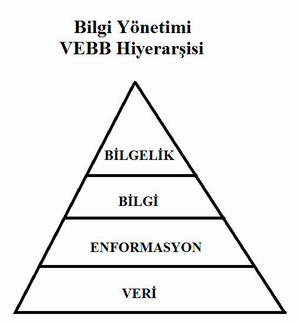
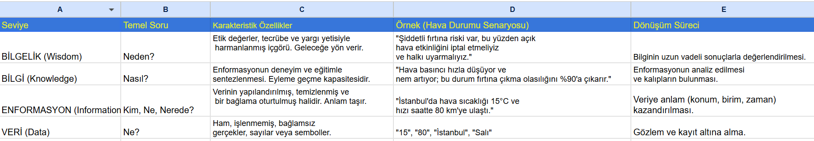
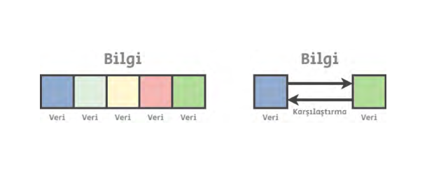
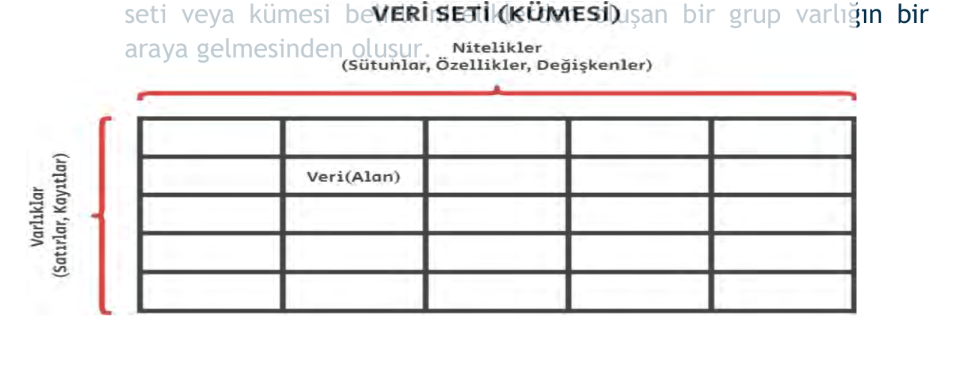
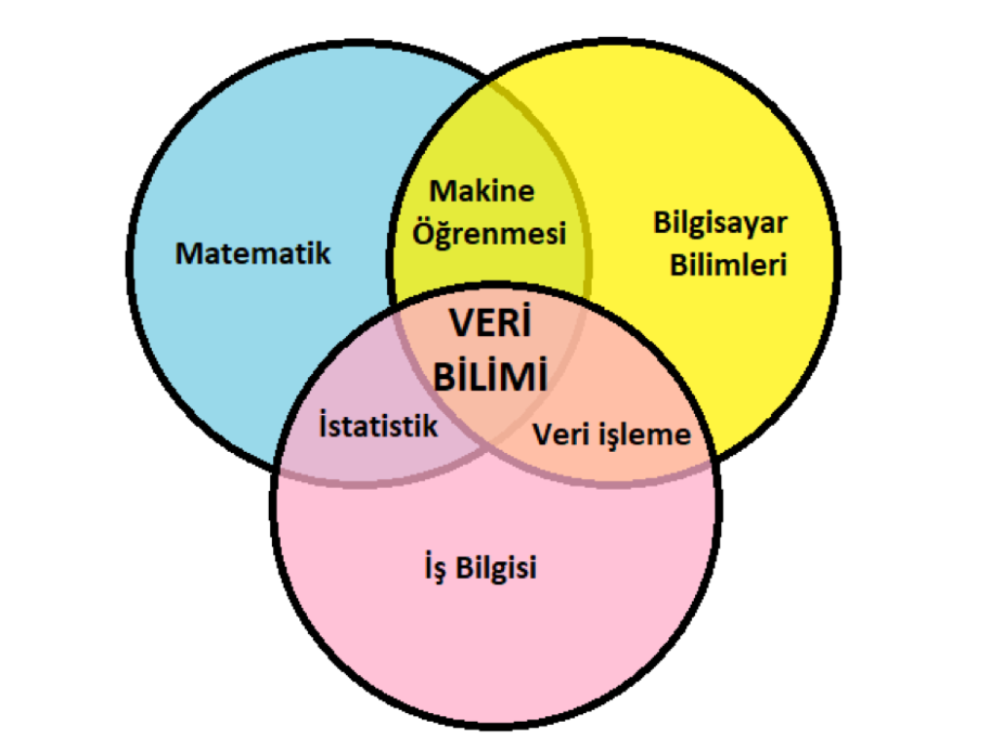
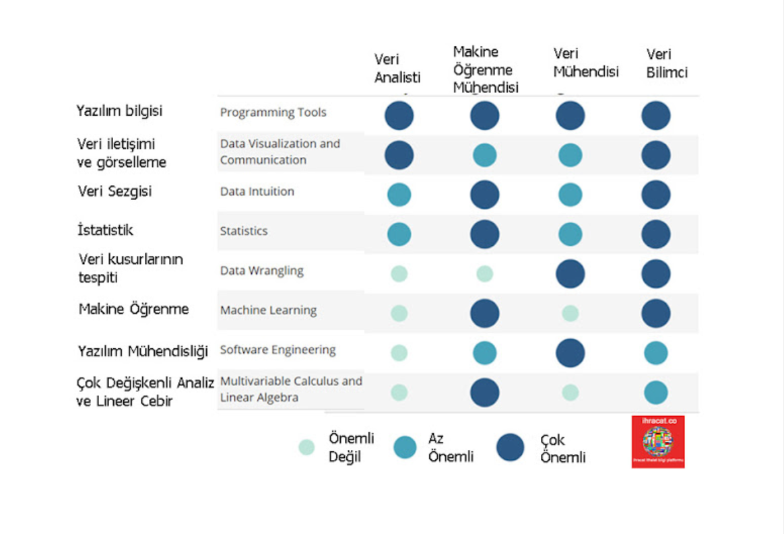
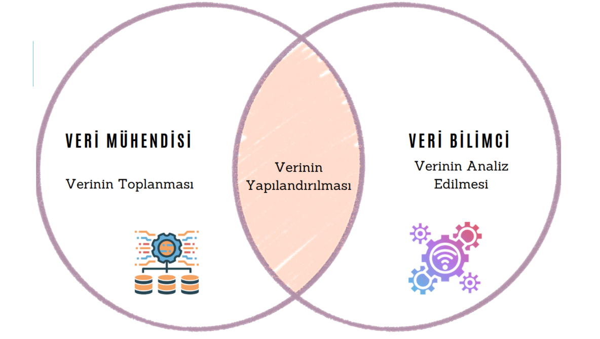
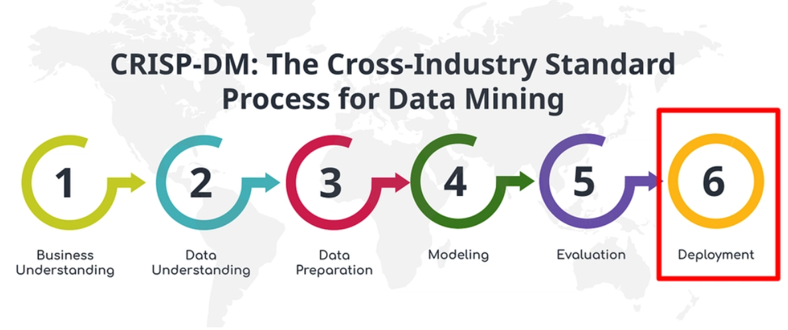

# Yapay-Zeka-ve-Veri-Bilimi-1-Python-ve-Veri-Uygulamalar-
Yapay-Zeka-ve-Veri-Bilimi-1-Python-ve-Veri-Uygulamalar Kurs Dökümanları ve Uygulama dosyaları

- [Giriş](#giriş)
- [Bilgi Piramidi Nedir?](#bilgi-piramidi-nedir)
- [Veri Nedir?](#Veri-nedir)
- [Veri Seti?](#Veri-Seti)
- [Veri Bilimi ve Veri Bilimci Nedir?](#veri-bilimi-ve-veri-bilimci-nedir)
- [VERİ BİLİMCİLERİN SAHİP OLMASI GEREKEN BİLGİ VE BECERİLER](#VERİ-BİLİMCİLERİN-SAHİP-OLMASI-GEREKEN-BİLGİ-VE-BECERİLER)
- [Veri Analizi?](#Veri-Analizi)
- [Veri Mühendisi?](#Veri-Mühendisi)
- [Veri Madenciliği?](#Veri-Madenciliği)
- [Veri Mühendisi Vs Veri Bilimci?](#Veri-Bilimci-vs-Veri-Mühendisi)
- [Veri Bilimi Yaşam Döngüsüı](#veri-bilimi-yaşam-döngüsü)
- [Veri Madenciliği?](#Veri-Bilimi-Teknikleri)

# Giriş

> "Dünyayı değiştirmek istiyorsan, elindeki verileri anlamlı bir hikayeye dönüştürmeyi öğrenmelisin."  
> "Veri bilimi, veriden bilgiye giden bir köprüdür."  
> *Veri bilimi; istatistik, bilgisayar bilimleri ve alan bilgisinin büyüleyici bir kesişimidir." – Drew Conway  
> "Veri bilimciler, bir istatistikçiden daha iyi kod yazan ve bir yazılımcıdan daha iyi istatistik bilen kişilerdir." – Josh Wills

# Bilgi piramidi nedir?

Bilgi Piramidi'nin (DIKW) en temel katmanını oluşturan verinin temel özellikleri şunlardır:

 

# 1. Verinin Yapısı
Veri, farklı biçimlerde karşımıza çıkabilir:

Sayısal: 18, 102.5, -5 (Örn: Bir sensörden gelen sıcaklık değeri).

Metinsel: "Elma", "İstanbul", "Aktif" (Örn: Bir formdaki şehir alanı).

Sembolik: %, &, #.

Görsel/İşitsel: Bir fotoğraf karesi veya bir ses kaydı parçası.

# 2. "Ham" Olma Özelliği
Veri "hamdır" çünkü bağlamdan yoksundur.

Örnek: Elinizde sadece "42" sayısı olduğunu düşünün. Bu sayı tek başına bir anlam ifade etmez. Bir ayakkabı numarası mı? Bir evin kapı numarası mı? Yoksa bir şehrin plaka kodu mu? Bağlam eklenene kadar bu sadece bir veridir.

# 3. Veri Türleri (Bilişim ve İstatistik Açısından)
Veri biliminde veriler genellikle iki ana gruba ayrılır:

Yapılandırılmış Veri (Structured Data): Excel tabloları veya veritabanları gibi belirli bir düzende olan verilerdir. (Örn: İsim-Soyisim listesi).

Yapılandırılmamış Veri (Unstructured Data): Belirli bir kalıba uymayan verilerdir. (Örn: E-posta içerikleri, videolar, sosyal medya paylaşımları).

# 4. Veriden Bilgiye Giden Yol
Veri, işlendiği zaman değer kazanır:

Veri: 38 (Ham sayı).

Enformasyon: "Hava sıcaklığı 38 derece." (Bağlam eklendi).

Bilgi: "Hava 38 derece olduğuna göre dışarı çıkarken güneş kremi sürmeliyim." (Deneyim ve uygulama eklendi).

# Veri nedir?
Veri, en basit tanımıyla dünyadaki olayların, nesnelerin veya durumların ham, işlenmemiş ve henüz bir anlam kazanmamış temsilidir. Birer "yapı taşı" gibidirler; tek başlarına size bir hikaye anlatmazlar ama bir araya geldiklerinde dünyayı anlamlandırmanızı sağlarlar.
Veri bilginin en küçük birimi, parçasıdır. Veri latince “Datum” kavramından gelir. Veriler bir
araya gelip bilgiyi oluştururlar. Aslında veridediğimiz kavram, gerçeğin bir soyutlamasıdır. Veri
tek başına bir şey ifade etmez, bir anlam, bilgioluşturmaz. Veriler bir bilgi bütününün parçası
olabildikleri gibi başka verilerle kıyaslanarak da  bilgi döndürürler.

# Veri Seti 
Varlıklar veya olgular verilerle ifade edilirler. Her bir varlık da bir
takım nitelikteki (özellik, değişken) verilerin bir araya gelmesiyle
tanımlanır. Örneğin bir araba marka, model, uzunluk, motor hacmi
vs. gibi birçok nitelikle tanımlanır. Arabalara dair bir veri seti
oluşturmak istersek, bu niteliklere sahip verilerden oluşan
varlıkların(arabaların), her birine ait kayıtlarını(satırlar)
oluşturmalıyız. Tanım biraz uzun oldu ancak aşağıdaki şemadan bu
durum daha net anlaşılıyor. Daha kısa ifade etmek istersek, bir veri
seti veya kümesi belirli niteliklerden oluşan bir grup varlığın bir
araya gelmesinden oluşur.

# Veri Bilimi ve Veri Bilimci Nedir?
Veri Bilimi, ham verilerden anlamlı içgörüler, stratejik bilgiler ve öngörüler çıkarmak için istatistik, matematik, programlama ve alan uzmanlığını birleştiren çok disiplinli bir alandır.

Basitçe ifade etmek gerekirse; geçmişin verilerine bakarak bugünü anlama ve geleceğe dair isabetli tahminler yapma sanatıdır.

Bu süreci yöneten kişiye ise veri bilimci denmektedir. Aşağıdaki görselde bir veri bilimcide bulunan/bulunması gereken özellikler gösterilmiştir.

# VERİ BİLİMCİLERİN SAHİP OLMASI GEREKEN BİLGİ VE BECERİLER

# 1- Veri bilimcileri, Programlama dillerine hakim olmalıdır
Veri Bilimi Becerileri - Programlama – Çalıştığınız şirketin sektörü ne olursa olsun, muhtemelen ticaret araçlarını nasıl kullanacağınızı bilmeniz beklenir. Bu sebeple örneğin Python gibi istatistiksel bir programlama dili ve SQL gibi bir veritabanı programını kullanabiliyor olmanız gerekmektedir.

# 2- Veri bilimcileri, İstatistik konusunda bilgili olmalı
Veri bilimci olarak istatistiklerin iyi bir şekilde anlaşılması hayati öneme sahiptir. İstatistiksel testler, dağılımlar, maksimum olasılık tahmincileri, vb. konulara aşina olmalısınız. Bu, aynı zamanda makine öğrenimi için de geçerlidir, ancak istatistik bilgilerinizin en önemli yönlerinden biri, farklı tekniklerin ne zaman (veya değil) geçerli bir yaklaşım. İstatistikler, tüm şirket türlerinde önemlidir, ancak paydaşların kararlarını vermek ve deneyleri tasarlamak / değerlendirmek için yardımınıza bağlı olduğu özellikle veri odaklı şirketler önemlidir.

# 3- Veri bilimcileri, Makine öğrenme becerilerine sahip olmalıdır
Özellikle büyük miktarda veri içeren bir şirkette veya ürünün kendisinin özellikle veri odaklı olduğu bir şirkette (örn. Bilişim, medya, reklam, pazarlama firmaları) çalışıyorsanız, makine öğrenme yöntemlerine aşina olmanız gerekmektedir. Bu tekniklerden birçoğunun R veya Python kütüphaneleri kullanılarak uygulanabileceği doğrudur bu nedenle, algoritmaların nasıl çalıştığına dair bir uzman olmak zorunlu değildir. Veri bilimcisinin farklı teknikleri kullanmanın ne zaman uygun ve gerekli olduğunu biliyor olması bu işteki başarı kriterini belirler.
Makine öğrenme nedir: Makine öğrenimi, yazılım uygulamalarının net olarak programlanmadan sonuçların tahmininde daha doğru olmasını sağlayan yapay zeka (AI) bir türüdür. Makine öğreniminin temel önceliği, giriş verilerini alabilen ve bir çıktı değerini kabul edilebilir bir aralıkta öngörmek için istatistiksel analizi kullanabilen algoritmalar oluşturmaktır.

# 4- Veri bilimcileri, Çok Değişkenli Analiz yapabilmeli ve Lineer Cebir bilmeli
Bu kavramları anlamak, ürünün veriyle tanımlandığı şirketlerde çok önemlidir ve tahmini performansdaki veya algoritma optimizasyonundaki küçük gelişmeler şirket için büyük kazanımlara neden olabilir.

Bir veri bilimi rolüyle ilgili bir röportajda, başka yerde çalıştığınız makine öğrenimi veya istatistik sonuçlarından bazılarını türetmeniz istenebilir. Veya görüşmeci, bu tekniklerin temelini oluşturduğu için, temel çok değişkenli hesap veya doğrusal cebir sorularını isteyebilir.

Python veya R'de çok sayıda kutu uygulaması olduğunda, bir veri bilimcisinin bunu neden anlaması gerektiğini merak edebilirsiniz. Yanıt, belli bir noktada bir veri bilim ekibinin, bir yazılım oluşturması veya geliştirmesi beklenebilir. 

# 5- Veri bilimcileri, Veri kusurları ve eksiklilkleri ile başedebilmeli
Analiz edeceğiniz veriler çok dağınık ve/veya çok geniş bir alanı kapsıyor olabilir. Bu nedenle, verilerdeki eksiklik ve kusurlarla nasıl başa çıkacağını bilmek gerçekten önemlidir. Veri kusurlarına örnek olarak, eksik değerler, tutarsız dize biçimi, tarih biçimlendirmesi, unix zamanı, zaman damgaları vs..

# 6- Veri bilimcileri, Veri Görselleştirme ve İletişim tekniklerine hakim olmalı
Veri bilimcileri, elde ettikleri bulguları, ilgili kişi ve birimlere aktarırken, doğru iletişim ve görselleme tekniklerini kullanmalı, bu aşamada, elde ettikleri verilerin nasıl algılanacağını nasıl gözlemleneceğini öngörüyor olmaları beklenir.

Görselleştirme açısından, matplotlib, ggplot veya d3.j gibi veri görselleştirme araçlarını tanımak son derecede yardımcı olabilir. Sadece verileri görselleştirmek için gerekli olan araçları değil, aynı zamanda görsel olarak veri şifreleme ve bilgi iletişiminde kullanılan ilkeleri de bilmek önemlidir.

# 7- Veri bilimcileri ve Yazılım Mühendisliği
Özellikle küçük bir şirkette, tek başına veya küçük bir ekiple çalışan firmaların öncelikli tercihi, yazılım mühendisliği kökenli bir veri bilimciyle çalışmak olacaktır. Program kullanma ve geliştirme becerilerinin yardımı olmadan bir sürü veri günlüğü ile potansiyel olarak veri odaklı ürünlerin geliştirilmek zor olacaktır. Veri bilişimini faaliyet alanı olarak seçen firmalarda ya da veri bilişimi için ekip kuran firmalarda, veri bilimcilerin matematik, istatistik, pazarlama gibi farklı meslek kökenlerinden uzmanları da içermesi faydalı olacaktır.

# 8- Veri bilimcileri Veri Sezgisi
İşverenler, veri bilimcilerinin, veri odaklı bir problem çözücü olduğunu görmek istiyorlar. Veri bilimcileri bir iş mülakatında ya da veribilimi ve analizine yönelik başka bir firmadan gelen bir iş talebinde Görüşme sürecindeki bir noktada, şirketin geliştirmeyi istediği veri odaklı ürüne yönelik bir soru yöneltebilirler. 

 # Veri Analizi
Veri analizi, bir çalışma aracılığıyla toplanan verilerin kapsamlı ve dikkatli bir şekilde
gözden geçirilmesi ve yorumlanmasıdır. Veri analizi daha sonra araştırma sorularını
doğru bir şekilde cevaplamak için kullanılabilecek sonuçlar verir. Veri analizi hem nitel
araştırmalarda hem de nicel araştırmalarda gerçekleşir.

# Veri Mühendisi
Veri mühendisleri, veri toplama,
yönetimi, dönüşümü ve erişimi
için veri altyapısını tasarlamak,
sürdürmek ve optimize etmekten
sorumludur.

Veri mühendisi, ham veriler ve
öğelerin analize hazır olup
olmamasına odaklanır. Gerçek
zamanlı analitiği mümkün kılan
çeşitli büyük veri teknolojilerini
birleştirerek serbest akışlı veri
hatları oluşturur.

# Veri Madenciliği
Veri madenciliği, belirli bir amaç için kullanılabilecek ilgili bilgileri bulmak
üzere büyük veri kümelerini eleme işlemidir. Hem veri bilimi hem de iş
zekâsı için gerekli olan veri madenciliği, temelde tamamen örüntülerle
ilgilidir.

Verilerin toplanıp saklanmasından sonraki adım, bu verilerden anlam
çıkarmaktır.
 
# Veri Bilimci vs Veri Mühendisi
Veri mühendisi ve veri bilimci arasındaki temel fark, verinin işlenme süreci ve odak noktasıdır. En kısa tanımıyla: Veri mühendisi verinin akacağı "boruları" ve altyapıyı kurar; 
veri bilimci ise bu borulardan akan veriyi analiz ederek ondan anlamlı içgörüler ve tahminler üretir

# 1. Temel Sorumluluklar
Veri Mühendisi (Mimar): Verinin toplanması, depolanması ve işlenmesi için gerekli olan sistemleri ve veri işlem hatlarını (pipelines) tasarlar ve inşa eder. Ham veriyi temiz ve analiz edilebilir hale getirmekten sorumludur.
Veri Bilimci (Yorumcu): Mühendislerin hazırladığı veriyi kullanarak makine öğrenimi modelleri, istatistiksel analizler ve tahminleme çalışmaları yapar. Şirketin stratejik kararlar almasına yardımcı olacak soruları yanıtlar.

# 2. Kullanılan Araçlar ve Beceriler
Veri Mühendisi: SQL, NoSQL veritabanları, büyük veri teknolojileri (Hadoop, Spark), ETL süreçleri ve Java/Scala/Python gibi programlama dillerine odaklanır.
Veri Bilimci: Python, R, istatistik, lineer cebir, makine öğrenimi kütüphaneleri (Scikit-learn, TensorFlow) ve veri görselleştirme araçlarını (Tableau, PowerBI) kullanır.

 # 3 Eğitim ve Geçmiş
Veri Mühendisleri genellikle Bilgisayar Mühendisliği veya Yazılım Mühendisliği kökenlidir ve daha çok yazılım geliştirme disiplinine yakındır.
Veri Bilimciler ise İstatistik, Matematik, Ekonomi veya Fizik gibi alanlarda eğitim almış olup akademik veya araştırmacı bir yaklaşıma sahip olma eğilimindedir

# Veri Bilimi Yaşam Döngüsü

Veri bilimi yaşam döngüsü, bir problemin verilerle çözülmesi sürecinde izlenen sistematik adımlar bütünüdür. En yaygın kabul gören model olan CRISP-DM (Cross-Industry Standard Process for Data Mining) temel alınarak süreç şu şekilde işler:

# 1. İş Problemini Anlama (Business Understanding)
Süreç bir teknikle değil, bir soruyla başlar. "Müşterilerimiz neden aboneliklerini iptal ediyor?" veya "Gelecek ayki satışlar ne olacak?" gibi iş hedefleri belirlenir ve başarı kriterleri tanımlanır.
# 2. Veri Edinme ve Anlama (Data Acquisition)
Belirlenen problemi çözmek için hangi verilere ihtiyaç duyulduğu saptanır. Veriler veritabanlarından, API'lerden veya web kazıma (scraping) yöntemiyle toplanır. Verinin yapısı, kalitesi ve eksiklikleri bu aşamada incelenir.
# 3. Veri Hazırlama ve Temizleme (Data Preparation)
Zamanın en büyük kısmının (%70-80) harcandığı yerdir. Ham veri; gürültülerden arındırılır, eksik değerler doldurulur, hatalı girişler düzeltilir ve analiz edilebilir formata (tablolara) dönüştürülür.
# 4. Keşifçi Veri Analizi (EDA - Exploratory Data Analysis)
Verideki desenleri, aykırı değerleri ve değişkenler arasındaki ilişkileri anlamak için istatistiksel yöntemler ve görselleştirme araçları kullanılır. Bu adım, hangi makine öğrenimi modelinin seçileceğine karar vermeyi sağlar.
# 5. Modelleme (Modeling)
Hazırlanan veri üzerinde çeşitli algoritmalar (regresyon, sınıflandırma, kümeleme vb.) denenir. Veri genellikle "eğitim" ve "test" seti olarak ikiye ayrılır; model eğitim setiyle öğrenir.
# 6. Değerlendirme (Evaluation)
Modelin performansı test verileriyle ölçülür. "Model yeterince isabetli mi?", "İş hedeflerini karşılıyor mu?" sorularına yanıt aranır. Eğer sonuçlar zayıfsa önceki adımlara geri dönülür.
# 7. Dağıtım ve İzleme (Deployment & Monitoring)
Başarılı olan model gerçek dünya ortamına entegre edilir. Ancak iş burada bitmez; zamanla veriler değişebileceği için modelin performansı sürekli izlenir ve gerektiğinde yeniden eğitilir.

# Veri Bilimi Teknikleri

Veri bilimi teknikleri, veriden anlamlı içgörüler çıkarmak için kullanılan matematiksel, istatistiksel ve algoritmik yöntemlerdir. Bu teknikler genellikle problemin türüne (tahmin, gruplandırma veya keşif) göre seçilir. 

En yaygın kullanılan veri bilimi teknikleri şunlardır:
# 1. Tahminleme ve Modelleme (Prediction & Modeling)
  # a-Regresyon Analizi:
  Birbiriyle ilişkili değişkenler arasındaki matematiksel bağı kurarak gelecek değerleri tahmin etmek için kullanılır. (Örn: Ev fiyatı tahmini).
  Regresyon, alakasız görünen iki veri noktası arasında bir ilişki bulma
  yöntemidir. Bağlantı genellikle bir matematik formülü etrafında modellenir ve
  bir grafik ya da eğriler olarak temsil edilir. Veri noktalarından birinin değeri
   bilindiğinde, diğer veri noktasını tahmin etmek için regresyon kullanılır.
    Örneğin:
   Hava yoluyla bulaşan hastalıkların yayılma hızı.
   Müşteri memnuniyeti ile çalışan sayısı arasındaki ilişki.
   Belirli bir konumda itfaiye istasyonlarının sayısı ile yangından kaynaklanan
  yaralanma sayısı arasındaki ilişki.
  # b-Sınıflandırma (Classification):
  Veri noktalarını belirli kategorilere ayırır. (Örn: Bir e-postanın "spam" olup olmadığını belirleme).
  Sınıflandırma, verilerin belirli grup veya kategorilere tasnif edilmesidir.
   #, verileri belirlemek ve tasnif etmek üzere eğitilir. Bilinen veri
  kümeleri kullanılarak, bir bilgisayarda verileri hızlı bir şekilde işleyen ve
  kategorize eden karar algoritmaları oluşturulur. Örneğin:
  Ürünleri popüler veya popüler değil olarak tasnif etme Sigorta başvurularını yüksek riskli veya düşük riskli olarak tasnif etme
  Sosyal medya yorumlarını olumlu, olumsuz veya nötr olarak tasnif etme.
  Veri bilimi uzmanları, veri bilimi sürecini izlemek için bilgi işlem sistemleri
  oluşturur.
  # c-Zaman Serisi Analizi:
  Geçmiş zaman verilerini inceleyerek gelecekteki eğilimleri öngörür. (Örn: Hisse senedi piyasası analizi)

 # 2. Veri Yapılandırma ve Gruplandırma
 # Kümeleme (Clustering):
 Benzer özelliklere sahip veri noktalarını (önceden tanımlanmış bir etiket olmadan) doğal gruplara ayırır. (Örn: Müşteri segmentasyonu).
  # İlişkilendirme Kuralları (Association Rules): 
  Veri setindeki öğeler arasındaki ilginç ilişkileri bulur. (Örn: "Marketlerde ekmek alanlar genelde süt de alır" kuralı).
  # Anomali Algılama (Anomaly Detection): 
  Normal veri akışından sapan, şüpheli veya nadir durumları tespit eder. (Örn: Kredi kartı dolandırıcılığı tespiti). 
